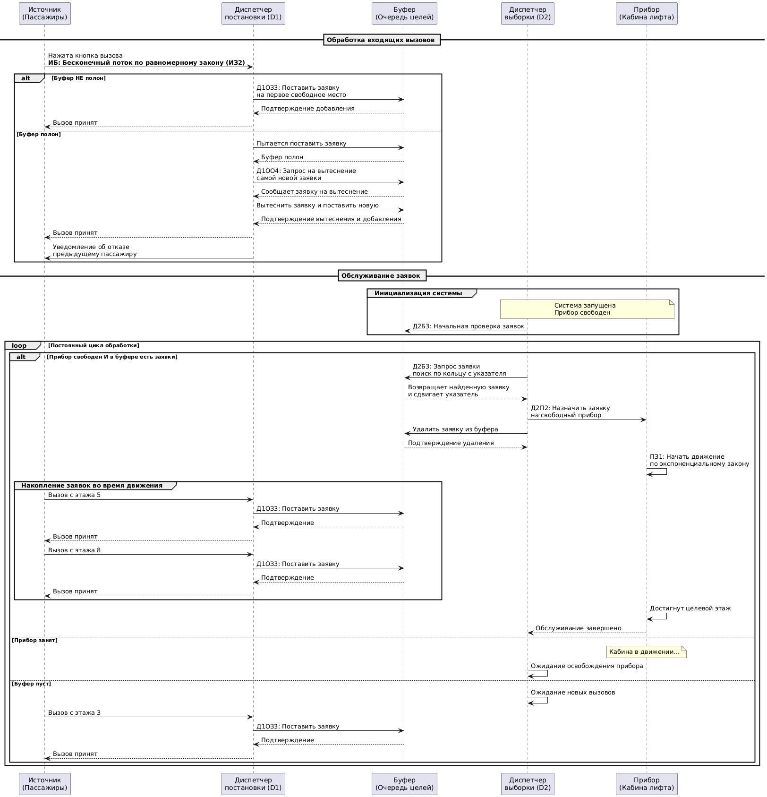

# Проект Умного Лифта
Репозиторий для проекта по дисциплине "Архитектура программных систем".
Бизнес-Домен: Система управления лифтом в здании. 

## Расшифровка варианта:
Источники:
- ИБn — бесконечный;
- ИЗ2 — равномерный.

Приборы:
- ПЗ1 — экспоненциальный.

Д1ОЗ3 – Буферизация.
Постановка заявки на свободное место.
Заявка встанет в очередь на первое от начала свободное место, если такое найдется. Сдвига очереди в этом случае не происходит.

Д1ОО4 — последняя поступившая в буфер.
Самая последняя заявка из поступивших в буфер, т. е. заявка, меньше других простоявшая в очереди, выбивается из БП, и на её место встаёт пришедшая заявка.

Д2П2 — выбор прибора по кольцу.
Эта дисциплина производит выбор свободного прибора таким же способом, как и аналогичная дисциплины выбора заявок из буфера по кольцу, т. е. поиск свободных приборов каждый раз начинается с указателя, и заявка встает на обслуживание на первый из найденных приборов.

Д2Б3 — Выбор заявки из буфера «по кольцу».
Эта дисциплина выбора работает аналогично дисциплине постановки в БП «по кольцу». Здесь также вводится понятие «Указателя», который принимает значение номера места, с которого начинается поиск заявок в БП. Как только будет найдено место, занятое заявкой, эта заявка ставится на освободившийся прибор, а указатель передвигается на место, следующее за тем, откуда была выбрана на обслуживание заявка. Поиск следующего занятого места буфера будет производиться также, начиная с указателя.

Динамическое отражение результатов (пошаговый режим).
- ОД3 — временные диаграммы, текущее состояние.
Шаг в этом случае — интервал модельного времени от одного особого события до другого ближайшего по времени особого события.

Отражение результатов после сбора статистики ОР1-ОР2 (автоматический режим).
- ОР1 — сводная таблица результатов

## Комментарии по программе
Работа выполнялась в Visual Studio (на c++, соответственно).
Дисциплина Д2П2 (выбор прибора "по кольцу") имеет смысл, если приборов несколько.
Поскольку в сиквенсе тоже подразумевается возможность нескольких приборов, но в бизнес-домене сказано: "Рассматриваем логику принятия решений для ОДНОГО лифта", я решила все же оставить 2 лифта. Тем не менее, если требуется демонстрация с 1 прибором, можно в main.cpp изменить int numElevators = 1;  
Использование зонного буфера возможно, например, разделение на несколько областей по этажам или по направлению лифта. Тем не менее, я предпочла оставить обычный буфер, где все заявки равноправны.

Краткое описание программы:
1. Пассажиры генерируют вызовы равномерно по этажам
2. Диспетчер постановки пытается добавить заявку в буфер
- Есть место - добавляет
- Нет места - вытесняет самую новую заявку
3. Диспетчер выборки забирает заявки из буфера по кольцевому алгоритму
4. Лифт обслуживает заявки с экспоненциальным временем движения

В пошаговом режиме видно:
- Состояние буфера и указателя
- Движение лифта
- Процесс вытеснения заявок
- Статистику отказов

## Сиквенс-диаграмма

## Диаграмма классов

## Flowchart с дорожками

